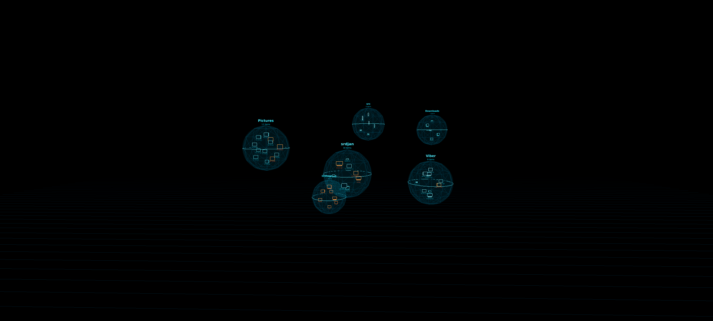

# ioi — a 3D world engine for file systems

**Spec v0.1 — draft for review.** This document records what we have agreed so far. Its job is to check that we understand each other, not to be complete. Every section ends with the open questions I still have. Text marked **assumption** is something I decided without asking.

---

## 0. Purpose

ioi turns a file system into a walkable 3D world. Directories, files, people, conversations and social posts become objects whose **shape and position encode their metadata**, so a user navigates by reading the space rather than reading labels.

The same data can be shown as completely different worlds. A world is a skin: layout, camera, physics, textures, controls and the visual grammar are all the world's business. The data underneath never changes.

## 1. Principles

1. **Metadata is the product. Worlds are skins.** One metadata index, many worlds.
2. **Readable from the door.** A room must be understandable at zero bytes downloaded, from shapes and positions alone. Detail refines the picture, it never changes it.
3. **Stream, do not load.** The world grows around the player. Nothing is loaded before it is needed.
4. **Everything in 3D.** Metadata, annotations, the media player and its controls are objects in the scene. The only DOM element is an invisible text input that catches the soft keyboard.
5. **The annotation is the only message.** Comments, direct messages, group chats and notes are all annotations on a target node.
6. **Private by default. `#ioi` is the only publish switch.**
7. **The default world always works.** A Tron-styled default world ships in the client, needs no downloads, and fills in anything another world leaves out.
8. **User-published worlds are declarative.** They cannot run code. Connectors that touch account tokens are first-party or reviewed.

## 2. Vocabulary

| Term | Meaning |
|---|---|
| **Hub** | The backend a user owns. Scans sources, holds the metadata index and account tokens, serves the stream. Runs on the phone as a companion service, on a laptop, or on a home server. |
| **Client** | The PWA with the three.js renderer. Talks only to the user's hub. |
| **Source** | Where items come from: local files, connected accounts, shared items, uploads. |
| **Node** | Anything in the virtual tree: a dir, an item, a person, a pair, a group. |
| **Item** | A leaf node with content: a file, a post, an upload. |
| **Record** | The metadata document for one node. |
| **Annotation** | A message attached to a target node, optionally to a region or time range of it, optionally replying to another annotation. |
| **Op** | One line of the down stream from hub to client. |
| **Event** | One line of the up stream from client to hub. |
| **World** | A pack from the registry that turns nodes and annotations into a scene. |
| **Legend** | A world's declared mapping from metadata fields to visual channels. |
| **Accent** | A world's declared mapping from annotation stats to a visual or physical channel. |
| **Tier** | A level of detail for an asset: 0 procedural, 1 light, 2 full. |
| **Registry** | Public service where anyone publishes worlds. Also hosts first-party connectors under a separate trust tier. |
| **Sharing service** | Relay between hubs for shared items and annotations. Relays, does not read. |

## 3. Architecture

```
  sources                     hub                          client (PWA)
  ───────                     ───                          ────────────
  local fs  ──scan──┐                                      three.js renderer
  accounts  ──sync──┤   metadata index (sqlite)            active world + default world
  shared    ──sub───┼──▶ virtual tree            ══ws══▶   op applier
  uploads   ──recv──┘   stream server            ◀═ws══   event emitter
                        model assistance ──┐               asset loader (tiers)
                        token store        │               in-world UI, player
                                           ▼
                                      model API (opt-in)

  registry ──── world packs (declarative) ────▶ client
  registry ──── connectors (first-party) ─────▶ hub
  sharing service ◀──▶ hub ◀──▶ other hubs
```

The client never talks to a source, the model, or another user's hub directly.

**Open:** where the hub runs on a phone-only setup. Android Chrome does not let a PWA walk the file system, so a phone-only user needs either a small native companion service or a hub elsewhere. Assumption for v1: the hub runs on a laptop or server and the phone is a viewer, with uploads via the share sheet as the phone's way in.

## 4. Sources and the virtual tree

All sources mount into one tree. Paths are the node ids.

```
/local/…                          the scanned file system, real paths
/accounts/instagram/@name/posts/YYYY/MM/
/accounts/instagram/@name/saved/
/shared/@other/…                  items other people shared with me
/uploads/YYYY/MM/                 files sent to the hub from the client
/people/@name                     person nodes
/pairs/@a|@b                      pair nodes (direct messages)
/groups/<id>                      group nodes
```

### 4.1 Local files
The hub walks configured roots, watches for changes, and runs extractors: mime, EXIF, ffprobe, and origin detectors that recognize app folders such as Viber and WhatsApp media.

### 4.2 Connected accounts
Instagram in v1. Two routes, both mounting to the same place:

- **Data export import.** The user drops Instagram's "Download your information" zip into a watched folder. Works for every account type, no API keys.
- **Instagram API with Instagram Login.** Professional accounts only, needs a Meta app and app review. Incremental sync by post id. Media is cached locally because CDN URLs expire.

Tokens live in the hub, encrypted, read-only scopes. Disconnecting deletes the token and optionally the cache.

### 4.3 Shared items
Items other users published to me arrive through the sharing service and mount under `/shared`. See §7.

### 4.4 Uploads
The client accepts files through the file picker, drag and drop, and the Android share sheet via the Web Share Target API, and forwards them to the hub. Uploads are private items like any other.

## 5. The record

One record per node. Stored in the hub's index, keyed by id and content hash so it survives renames. Only the `shape` block is 3D-flavoured, and it is deliberately abstract.

```json
{
  "id": "f:/local/sdcard/Viber/media/Viber Images/IMG-2026-03-12.jpg",
  "kind": "item",
  "hash": "sha1:…",
  "category": "image",
  "name": "IMG-2026-03-12.jpg",
  "size": 3182044,
  "mime": "image/jpeg",
  "origin": {"app": "viber", "kind": "received", "from": "@marko"},
  "media": {"w": 4032, "h": 3024, "taken": "2026-03-12T14:02:00Z", "place": "Novi Sad"},
  "text": null,
  "tags": ["family", "trip"],
  "public": false,
  "link": null,
  "shape": {"weight": 0.8, "group": "2026-03", "pinned": null},
  "created": "2026-03-12T14:02:00Z",
  "modified": "2026-03-12T14:02:00Z"
}
```

Field notes:

- `kind`: `dir`, `item`, `person`, `pair`, `group`.
- `category`: `image`, `video`, `carousel`, `audio`, `document`, `archive`, `code`, `other`. Dirs and people have none.
- `origin.app`: `fs`, `viber`, `whatsapp`, `camera`, `browser`, `instagram`, `upload`, `shared`.
- `text`: caption or body, when the source has one.
- `tags`: from the source (hashtags), the user, or the model. Ordinary tags carry no special meaning.
- `public`: true only when the node carries the `#ioi` tag. See §8.
- `link`: permalink to the original when there is one.
- `shape.weight`: 0..1, a normalized importance the world may map to size, height, or anything. Computed by the hub from size, engagement, and recency.
- `shape.group`: a grouping key the world may cluster by. Default is the month.
- `shape.pinned`: an optional position the user fixed, in world-independent units, ignored by worlds that do not support pinning.

An Instagram post maps onto the same record: caption to `text`, hashtags to `tags`, likes and comments into `weight`, the permalink to `link`, comments to annotations by other people.

Who writes the record, in order: extractors, origin detectors, the user, the model. Model output is always marked `by: "ai"` where it appears and can be reviewed or discarded.

**Open:** the exact weight formula. **Assumption:** log of size, plus engagement, decayed by age, normalized per parent dir.

## 6. Annotations

An annotation is a message attached to a target. It is the only message primitive.

```json
{
  "id": "ann:9f3c",
  "target": "f:/local/…/IMG-2026-03-12.jpg",
  "parent": null,
  "by": "@ana",
  "text": "this is the one for the wall",
  "region": {"x": 0.2, "y": 0.3, "w": 0.1, "h": 0.1},
  "range": null,
  "at": "2026-03-12T19:01:00Z",
  "stats": {"replies": 7, "reactions": 12, "views": 40, "last": "2026-03-13T08:10:00Z"},
  "channels": {"heat": 0.91, "popularity": 0.75, "reach": 0.4, "age": 0.1}
}
```

### 6.1 Targets
Any node id. In particular:

- an **item**: a comment or note;
- an **item with `region`**: a note on part of an image, coordinates 0..1;
- an **item with `range`**: a note on a time span of a video or audio, seconds `[from, to]`;
- a **pair node** `pair:@a|@b`: a direct message between two people;
- a **group node**: a group conversation;
- a **person node**: a note on someone's wall.

### 6.2 Threads
`parent` points at another annotation. A thread is the chain. Worlds see a thread as a cluster with a root.

### 6.3 Reactions
A reaction is an annotation with no text and a single `reaction` field. It counts into the parent's stats and is not rendered as its own object.

### 6.4 Stats and channels
The hub computes raw `stats` and normalizes them into **channels** in 0..1: `heat` (recent activity), `popularity` (reactions and replies), `reach` (distinct viewers), `age`. Normalization is per room, so "most popular" means most popular here. Stats change often, so they are streamed as their own op, throttled.

### 6.5 Visibility
An annotation is visible to whoever can see its target. Pair and group threads are visible only to members, and their stats are computed on the members' hubs, never by the sharing service.

## 7. Sharing and explore

### 7.1 Publishing
A node becomes public when its record carries the `#ioi` tag. There is no other switch and no tag grammar. Other hashtags are ordinary tags.

- On Instagram: `#ioi` in the caption. The connector marks the post public on sync. Removing the tag or deleting the post unpublishes it on the next sync.
- On any local, uploaded or account item: adding the `ioi` tag through an in-world action does the same.

Publishing sends the record, the media, and the annotations the user chooses to the sharing service, addressed to an audience. **Assumption:** v1 audiences are `public` and `contacts`. Nothing is shared by default.

### 7.2 Hashtag discovery
The ioi service may watch `#ioi` through Instagram's hashtag search endpoint and place public tagged posts from anyone into the public explore world, attributed by permalink. Constraints: professional-account app only, limited distinct hashtags per week, public media only, no author username on media the app user does not own. A post that disappears from the tag feed is unpublished on the next sweep. Meta's data retention rules apply to cached media.

### 7.3 Explore mode
Every world has explore mode. It is a world switch onto the shared source. An explore world lays out **people** as anchors, clusters their shared items around them, and places model-suggested items between them. Suggestions come from metadata similarity: matching tags, places, dates.

Two rules: nothing is shared without the tag, and a person node is built only from what that person shared, never from files they appear in.

### 7.4 Sharing service
Relays records, media and annotations between hubs by audience. Stores what is needed for delivery to offline hubs. Does not read pair or group threads and never computes stats. **Open:** end-to-end encryption for pair and group threads in v1, or later. **Assumption:** later, but the relay is designed so it can be added without protocol change.

## 8. The stream

One WebSocket per client session. Both directions are newline-delimited JSON. Every op has a stable `id` derived from the node path, so re-sending is idempotent, and a `seq` so the client can resume.

### 8.1 Down: ops

Ops carry **no positions and no geometry**. Layout is the world's job on the client.

| op | Purpose | Key fields |
|---|---|---|
| `hello` | Session start | `proto`, `root`, `spawn`, `worlds` available |
| `dir` | A directory node | `id`, `name`, `dirs`, `items`, `record` |
| `item` | A leaf node | `id`, `parent`, `record` |
| `person` | A person node | `id`, `name`, `record` |
| `pair` | A pair node | `id`, `members` |
| `group` | A group node | `id`, `name`, `members` |
| `ann` | An annotation | the annotation document |
| `stat` | Updated channels for an annotation | `id`, `stats`, `channels` |
| `remove` | Node or annotation gone | `id` |
| `end` | A dir's contents are fully sent | `id` |
| `hint` | Model enrichment | `target`, `label` or `waypoint` or `world`, `by: "ai"` |
| `media` | Media availability | `id`, `thumb`, `medium`, `full` URLs on the hub |

Example:

```json
{"op":"hello","seq":0,"proto":1,"root":"/local/home/srdjan","spawn":"d:/local/home/srdjan","worlds":["default","fishtank@1.2.0"]}
{"op":"dir","seq":1,"id":"d:/local/home/srdjan","name":"srdjan","dirs":3,"items":12,"record":{…}}
{"op":"dir","seq":2,"id":"d:/local/home/srdjan/src","name":"src","dirs":4,"items":31,"record":{…}}
{"op":"item","seq":3,"id":"f:/local/home/srdjan/README.md","parent":"d:/local/home/srdjan","record":{…}}
{"op":"ann","seq":4,"id":"ann:9f3c","target":"f:/local/home/srdjan/README.md","by":"@ana","text":"…","channels":{…}}
{"op":"end","seq":5,"id":"d:/local/home/srdjan"}
{"op":"hint","seq":9,"target":"d:/local/home/srdjan/src","label":"TypeScript sources, touched today","by":"ai"}
```

A `dir` op carries counts, so the world can draw a door with "3 rooms, 12 items" before contents arrive.

Very large dirs: items are sent in pages, and the hub may send an `item` with `record.kind: "group"` standing for N similar items, expandable on request. **Open:** page size and grouping threshold.

### 8.2 Up: events

| ev | Purpose | Key fields |
|---|---|---|
| `enter` | Player entered a dir | `id` |
| `near` | Player approached a door | `id` |
| `pos` | Player position, throttled to a few per second | `dir`, `x`, `y`, `z` |
| `focus` | Player focused an item | `id` |
| `open` | Open the original | `id` |
| `expand` | Expand a grouped item | `id` |
| `annotate` | New annotation | annotation without `id`, `stats`, `channels` |
| `react` | Reaction | `parent`, `reaction` |
| `tag` | Add or remove a tag, including `ioi` | `id`, `add` or `remove` |
| `ask` | Natural-language question for the model | `text`, `dir` |
| `world` | Player switched world | `pack` |
| `resume` | Reconnect | `seq` |

### 8.3 When things are sent

1. **On connect:** the spawn dir in full, plus `dir` ops for its direct children. Nothing deeper.
2. **On `near` or `enter`:** that dir's contents, ending with `end`. The hub also sends `dir` ops one level beyond, so the next doors have signs.
3. **On leave:** the client keeps the current dir, its parent and siblings, and evicts anything more than two hops away. The hub does not track this.
4. **On change:** the watcher emits `item`, `dir`, `remove` as the file system or a synced account changes.
5. **Enrichment:** after a dir's `end`, the hub may hand that dir's summary to the model and forward resulting `hint` ops. Never blocking.
6. **Stats:** `stat` ops are coalesced and sent at most every few seconds per room.

## 9. Worlds

A world is a pack from the registry. It is **declarative**: a manifest plus assets, no code. The client interprets the manifest. Anything the manifest leaves out falls back to the default world, per slot.

### 9.1 Manifest

```json
{
  "name": "fishtank",
  "version": "1.2.0",
  "author": "@someone",
  "layout": {"algorithm": "cluster", "by": "shape.group", "spacing": 1.5},
  "camera": {"mode": "first-person", "height": 1.6, "fov": 75},
  "motion": {"mode": "swim", "speed": 3, "gravity": 0},
  "legend": {
    "category": {"channel": "shape", "map": {"image": "fish.flat", "video": "fish.long", "document": "shell", "dir": "cave"}},
    "shape.weight": {"channel": "size", "range": [0.4, 2.0]},
    "created": {"channel": "position.z", "order": "newest-near"},
    "shape.group": {"channel": "cluster"},
    "public": {"channel": "outline", "map": {"true": "accent", "false": "muted"}}
  },
  "accents": {
    "popularity": {"channel": "buoyancy"},
    "heat": {"channel": "pulse"},
    "age": {"channel": "opacity", "invert": true}
  },
  "player": {"surface": "glass", "timeline": "bubbles"},
  "budget": {"bytes": 60000000, "drawcalls": 400},
  "assets": {…}
}
```

### 9.2 Legend
Binds record fields to visual channels. Allowed channels: `shape`, `size`, `color`, `height`, `glow`, `position.x|y|z`, `cluster`, `outline`. **Rules enforced by the registry:** at most six bindings, one field per channel, one channel per field.

### 9.3 Accents
Binds annotation channels to visual or physical channels: `buoyancy`, `pulse`, `glow`, `height`, `opacity`, `orbit`, `size`. Worlds map only what they support; the default world supplies the rest.

### 9.4 Layout
Algorithms available to declarative worlds: `rooms` (treemap rooms with doors, the file-browser default), `cluster` (groups in open space), `timeline` (one axis is time), `gallery` (items on walls), `graph` (people as anchors, for explore). Each takes parameters from the manifest.

### 9.5 Motion
`fly` (default, twin-stick drone flight), `walk`, `swim`, `teleport`. Controls are the client's, the world picks the mode and parameters.

### 9.6 Player
A world may skin the player. The player contract (§11) is fixed.

### 9.7 World suggestions
Each world declares which fields it organizes by. The client ranks worlds for a dir by how well its dominant fields match, and offers the top ones at the door.

**Open:** whether worlds may ever include sandboxed code. **Assumption:** not in v1.

## 10. The default world

Ships inside the client. Zero downloads, all tier 0, all procedural. Tron look: black floor with emissive grid, unlit materials with glowing edges, fog for depth, no shadows, no textures beyond the grid.

Reference legend:

| Field | Channel |
|---|---|
| category | shape: images flat panels, videos panels with a base, documents slabs, dirs doorways, people pillars |
| shape.weight | size |
| created | position, newest nearest the door |
| shape.group | cluster |
| heat | glow |
| public | outline colour, cyan private, orange public |

Reference accents: popularity to glow, heat to pulse, age to opacity.

It is the fallback for every slot every other world leaves empty, and the reference implementation of the player and in-world UI.

## 11. Client

### 11.1 Shell
PWA. Manifest `display: fullscreen`, `orientation: landscape`. Fullscreen and orientation lock on first tap for the browser-tab case. `viewport-fit=cover`, `touch-action: none`, `overscroll-behavior: none`. Service worker precaches the client and tier 0 and 1 of the active world.

### 11.2 Controls
The default motion mode is **fly**, with drone-style twin sticks so the player can leave a room and view it from outside. Touch: the lower-left zone is the left stick, up and down for altitude, left and right for yaw; the lower-right zone is the right stick, up and down for forward and back, left and right for strafe; a drag anywhere else is free look. Movement has light inertia. The stick rings are drawn in the scene, parented to the camera, not as DOM. Desktop: WASD for forward and strafe, Q and E for down and up, arrow keys for yaw and pitch, mouse drag for free look. Optional gyroscope look later. Tap on an object raycasts into the scene. Hit areas on 3D controls are wider than their visible geometry.

### 11.3 In-world UI
Everything is in the scene. Text is signed-distance-field font. Metadata panels are anchored to the focused item where the world says. Annotations are anchored to their target: whole-file notes with the panel, regions as markers on the image surface, ranges as markers on the 3D timeline, threads fanned from their root with accents applied. Adding an annotation is a tap on the surface or timeline, which places a marker and opens a 3D text field backed by the hidden DOM input.

### 11.4 Player
A contract every world fills, the default world by default:

- a surface showing the image or video texture;
- a timeline with markers for range annotations;
- play, pause, seek, volume, loop, frame step;
- a dock pose the camera moves to on focus;
- buffering shown on the surface itself.

One video decoder active at a time on phones. Unfocused videos show poster frames. Playback starts on a tap.

### 11.5 Wayfinding
An `ask` returns a `hint` with a `waypoint`. The world draws a path or raises the target's glow. Search results are things you walk to.

## 12. Assets and loading

### 12.1 Tiers
Every asset in a world is published in three tiers.

| Tier | What | Size |
|---|---|---|
| 0 | Procedural stand-in described in the manifest: primitive, bounds, palette colour. Never downloaded. | bytes |
| 1 | Low-poly mesh, Meshopt-compressed glTF, one texture at most 256 px or flat colour. | 20 to 100 KB |
| 2 | Full mesh and KTX2 textures with mipmaps. | as needed |

### 12.2 Registry pipeline
Publishing is a pipeline. The author supplies glTF, or OBJ or FBX to be converted. The registry generates tier 1 by mesh simplification, compresses both tiers with Meshopt, transcodes textures to KTX2 with Basis Universal, derives tier 0 from bounds and dominant colour unless the author specified one, validates the legend rules, and **rejects** a pack whose tier 1 exceeds its byte cap or whose tier 0 cannot be derived.

### 12.3 Client loading
A priority queue keyed by distance and projected screen size, with cancellation when the player walks away.

1. Dir shell and all items at tier 0, instanced, same frame as the ops.
2. Tier 1 for what is in the frustum, nearest first.
3. Tier 1 for the rest of the dir while idle.
4. Tier 2 only within a few metres or in focus, within budget.

Tier swaps cross-fade. The world's `budget` is enforced by dropping tier 2 on distant items first, then tier 1. On a metered connection (Save-Data header or Network Information API) tier 2 loads only on explicit tap. Tier 2 is cached on demand with a size cap, evicted least recently used.

User media follows the same three steps: thumbnail, medium, full.

## 13. Model assistance

The model sits in the hub, never in the client, and is opt-in. It:

- enriches dirs with labels after `end`;
- answers `ask` with waypoints;
- suggests tags and groupings, marked `by: "ai"`;
- proposes world choices for a dir;
- in explore, computes item similarity for suggestions.

The model never sits in the hot path. Deterministic code produces the walkable world first; the model enriches it afterward.

**Open:** which model, local or hosted, and cost controls. **Assumption:** hosted, with per-dir summaries rather than full listings sent, and only for dirs the user has opted in.

## 14. Privacy and trust

- Metadata for local files stays on the user's hub. Nothing reaches the model or the sharing service without opt-in.
- `#ioi` is the only publish switch. Default is private.
- Account tokens live in the hub, encrypted, read-only scopes.
- Pair and group threads are visible only to members. Their stats are computed on members' hubs.
- Person nodes are built only from what that person shared.
- Worlds from the registry are declarative and cannot run code. Connectors are first-party or reviewed.

## 15. Non-goals for v1

- Writing back to Instagram.
- Multiplayer presence, seeing other players move in real time.
- Editing files from inside the world beyond tagging and annotating.
- iOS. The target is Android Chrome and desktop browsers.
- Sandboxed code in worlds.

## 16. Milestones

1. **Navigation shell.** Vite, three.js, default Tron world, first-person touch and desktop controls, PWA fullscreen, mock op stream from a static file.
2. **Hub v0.** Local scanner, extractors, sqlite index, WebSocket stream with `dir`, `item`, `end`, `remove`, live watcher.
3. **Records and legend.** Full record schema, weight computation, default legend driving tier 0 shapes.
4. **Annotations and player.** In-world player contract, annotations with regions and ranges, stats and accents, hidden text input.
5. **Worlds.** Manifest format, second layout algorithm, registry stub as a static folder, tier pipeline, budget enforcement.
6. **Sources.** Uploads via share sheet, Instagram export import, then Instagram API.
7. **Sharing.** `#ioi` publish, sharing service, `/shared` source, explore world with `graph` layout.
8. **Model.** Enrichment hints, `ask` with waypoints, world suggestions.

## 17. Open questions, collected

1. Where the hub runs for a phone-only user.
2. Weight formula.
3. Large-dir paging and grouping thresholds.
4. Audiences beyond `public` and `contacts`.
5. End-to-end encryption timing for pair and group threads.
6. Which model, and cost controls.
7. Whether worlds may ever carry sandboxed code.

---

## Appendix A. Default world, first render

A static render of the default Tron world from the doorway of a mock directory, produced by `prototype/default-world.html` with the reference legend from §10. No assets were downloaded: every object is tier 0.



What the picture encodes: doorways on the far wall are sub-directories with their counts on the sign; flat panels are images, panels on a base are videos with their timeline on the floor, low slabs are documents, the cube is an archive; size is weight; the nearest band is the newest month; cyan is private and orange is public; the spheres above items are annotations, rising and glowing with popularity.


---

## Appendix B. Tap-to-zoom navigation (this branch)

An alternative to drone flight, kept on the `tap-to-zoom` branch so the two can be compared.

- **Space, not rooms.** Every directory is a sphere floating in space, sized by its item count, with its items on a spiral inside at 0.6 of the radius. All spheres are visible from the start position, which is far out.
- **Tap to zoom.** Tapping a sphere dollies the camera straight in to 2.6 radii from its centre in 0.5 seconds with ease-in-out. Tapping an item dollies to 4.5 item-radii from it. Items are raycast before shells, so a tap inside a focused sphere picks the item.
- **Back.** A round button fixed at the bottom right as a DOM overlay, outside the scene, appears whenever there is somewhere to go back to. Tapping it returns to the previous view with the same 0.5 second zoom. Escape and Backspace do the same on desktop. This branch treats navigation chrome as overlay, an exception to principle 4, which stays for metadata, annotations and the player.
- **Orbit.** A drag orbits around the current focus target at the current distance. A tap is a press under 8 pixels of movement and under half a second.
- **Shell fade.** The shell of the sphere the camera is inside fades so it does not cross the focused item.
- **Look.** Sharp lines with only a hint of bloom, no text halo, and sphere wireframes kept faint so the items carry the picture.


